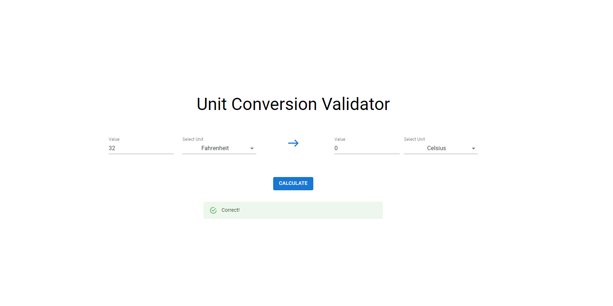
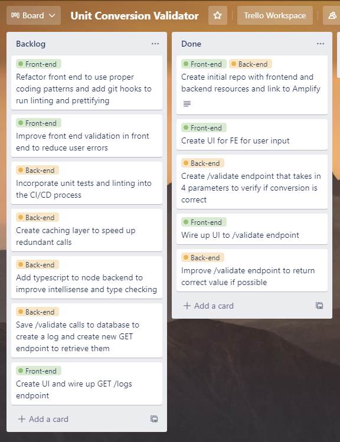

# Getting Started with Unit Conversion Validator

This project was created with the help of [AWS Amplify](https://aws.amazon.com/amplify/) to speed up full stack development. Amplify commands can generate lambdas within a local project that can be deployed by a ci/cd process wired to Github.

The development UI can be found [here](https://develop.d33bggktt1jq4h.amplifyapp.com/)
The production UI can be found [here](https://main.d33bggktt1jq4h.amplifyapp.com/)

Note: Currently the environments are identical since the main branch is up to date with development changes.

## Tech Stack

Frontend: React
Backend: AWS Lambda with a /validate function running javascript to handle the conversion processing

[This](https://beabetterdev.com/2021/10/28/aws-amplify-setup-react/) guide was used to get started at first with amplify setup.

## Improvements

A trello board was used to keep track of my tasks and plan out how this was going to be designed and implemented. Ideas that I wanted to implement but was not able to are created as backlog tickets. They are in a prioritized list. 

